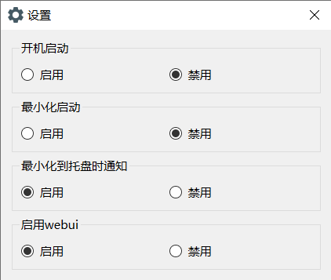

# Aria2 Launcher
- 使用C++和Qt6编写的程序
- 该程序为Aria2c.exe（即aria2）的一键启动器，专为小白设计
- 已集成webui（yaaw）界面

## 环境要求
仅支持Windows x64系统

## 使用
1. 解压
2. 打开Aria2 Launcher.exe
3. 下载文件
   - 第一种方法：下载文件时复制链接，点击程序右下角`打开控制界面(webui)`按钮，之后点击`添加`，将链接填入即可
   - 第二种方法：使用浏览器扩展`yaaw for chrome`或`aria2 for edge`直接自动下载

## 截图

